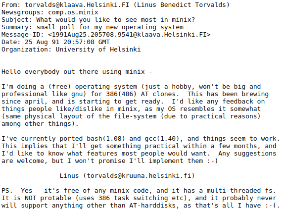

# Pengenalan kepada Linux

---

## Apa itu Unix?

- 1969, AT&T Bell Labs
- Dennis Ritchie, Ken Thompson
- Unics jadi Unix, Brian Kernighan

---

## Unix Clone?

- 1975, Universiti California
- Ken Thomposon bawa Unix v6
- 1977, Berkeley Software Distribution lahir
- Saman

---

## GNU is Not Unix

- 1983, GNU Project, Richard Stallman
- Rewrite Unix from scratch
- Tools siap, kernel takde

## Kernel

- Penghubung antara tool/program/aplikasi dengan perkakasan
  
---

# Sistem Operasi Freax

---

- Linus Torvalds, Helsinki, Finland
- Commodore Vic 20, BASIC, umur 10 tahun
- Susah dapat software kat Helsinki, so Linus buat software sendiri, games etc.
- **1991**, Universiti Helsiniki, MS-DOS, **Minix (Minimal UNIX)**, limited
- Linus start buat OS sendiri

---

```
linux-0.01.tar.Z	- sources to the kernel
bash.Z			    - compressed bash binary if you want to test it
update.Z		    - compressed update binary
RELNOTES-0.01		- this file

... snip snip ...

		1. Copyrights etc


This kernel is (C) 1991 Linus Torvalds, but all or part of it may be
redistributed provided you do the following:

	- Full source must be available (and free), if not with the
	  distribution then at least on asking for it.

	- Copyright notices must be intact. (In fact, if you distribute
	  only parts of it you may have to add copyrights, as there aren't
	  (C)'s in all files.) Small partial excerpts may be copied
	  without bothering with copyrights.

	- You may not distibute this for a fee, not even "handling"
	  costs.

Mail me at "torvalds@kruuna.helsinki.fi" if you have any questions.
```

--- 

### Email Linus kepada MINIX Mailing List




---

- **September 1991**, lahirlah `Linux v0.0.1`. Belum open source.
- **1992**, Linus release `Linux v0.0.2` guna lesen GPL dan jadi open source
- Nama asal `FreaX` (Free/Freak UNIX), tapi **Ari Lenke**, tukar kepada Linux, mengambil nama working directory yang Linus gunakan di `ftp.funet.fi` iaitu `/pub/os/linux`.

Kalau berminat nak tengok source code Linux, boleh tengok kat
https://github.com/torvalds/linux

---

# FAKTA !
## Linux ni untuk PC dan laptop sahaja.
### Setuju?

---

## Wrong! Salah! Nehi!

---

- Linux kernel digunakan secara meluas di pelbagai medium.
- PC, laptop
- Smartphone
- Smart appliance
  - Fridge, Smart TV, PS4 (dan PS5 juga mungkin)
- Banyak lagi.. antaranya boleh tengok kat sini:
  - https://www.unixmen.com/15-weirdsurprising-devices-amp-systems-that-run-on-linux/

---

## Linux Distro
### Distro? Kelab malam ke?

---

## Apa itu Linux distro?

---

- Linux distro (atau distribution) adalah sebuah gabungan komponen bagi memudahkan kita untuk menggunakan Linux.
- Kernel + tools & apps + package manager = distro
- Dan kebiasaannya, Linux distro turut datang dengan antaramuka pengguna berasaskan grafik (GUI). Contohnya Ubuntu.
- Tapi ada juga yang tiada GUI seperti Arch Linux.

---

## Distro Popular

---

- RedHat Enterprise Linux (RHEL)
  - Fedora (ditaja oleh RedHat)
  - CentOS (free alternative kepada RHEL, dibangunkan oleh komuniti)
  - RockyLinux (dikatakan pengganti kepada CentOS)

---

- Debian
  - Ubuntu (walaupun based dari Debian, tapi ia sangat popular!)
  - Linux Mint (based on Ubuntu & Debian)
  - Kali Linux (fokus pentesting)
  - PopOS (fokus gaming)

---

- Arch Linux
  - Manjaro (my favorite)
  - Artix (tanpa SystemD)
  - ArcoLinux
  - EndeavourOS

---

Boleh tengok kat sini untuk senarai distro yang ada:

https://upload.wikimedia.org/wikipedia/commons/b/b5/Linux_Distribution_Timeline_21_10_2021.svg

Banyak gila!

---

## Terminal vs Shell

---

- Terminal atau terminal emulator, medium yang kita guna untuk taip command
- Shell pula adalah intepreter kepada command tadi

